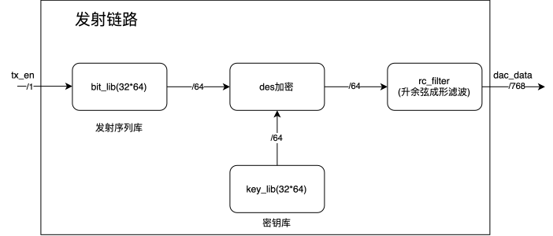
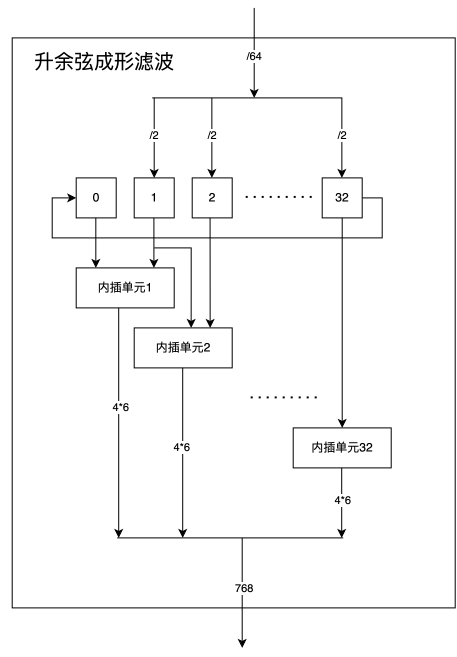

# 基于DES加密的PAM4通信链路

## 一、设计思路

### 1. MATLAB 功能仿真

#### 1.1 发射链路

发射链路的 MATLAB 仿真主要用于验证 PAM4 信号的升余弦脉冲成形，并为 FPGA 的定点化实现提供参考。相关脚本位于 [`matlab/pulse-shaping`](./matlab/pulse-shaping) 目录：

- [`main.m`](./matlab/pulse-shaping/main.m)：建立浮点脉冲成形模型，观察成形前后的时域波形及功率谱密度。
- [`fpga.m`](./matlab/pulse-shaping/fpga.m)：使用量化后的滤波器系数模拟 FPGA 查找表与内插过程，并通过抽样判决验证实现结果。

仿真采用的主要参数如下：

| 参数 | 数值 | 说明 |
| --- | ---: | --- |
| 采样频率 `fs` | 15.36 GHz | 系统采样频率 |
| 每符号采样点数 `sps` | 4 | 4 倍过采样 |
| 符号速率 `Rs` | 3.84 GBaud | 由 `fs / sps` 计算得到 |
| 滤波器跨度 `span` | 2 个符号 | 对应 9 个滤波器抽头 |
| 滚降系数 `beta` | 0.5 | 控制升余弦滤波器的过渡带宽 |

**浮点模型**

[`main.m`](./matlab/pulse-shaping/main.m) 首先生成幅度为 `-3`、`-1`、`1` 和 `3` 的随机 PAM4 符号序列，然后通过 `rcosdesign` 设计升余弦滤波器。符号序列经过 4 倍上采样和 FIR 滤波后，对滤波器引入的群时延进行补偿。最终绘制前 10 个符号的时域波形，并使用 Welch 方法估计成形信号的功率谱密度。

**FPGA 等效模型**

[`fpga.m`](./matlab/pulse-shaping/fpga.m) 将滤波器系数量化为：

```text
[0, 14, 31, 46, 52, 46, 31, 14, 0]
```

使用 `0`～`3` 表示四种 PAM4 符号，并根据不同符号幅度预先生成 `4 × 9` 的滤波器查找表。由于滤波器跨度为 2 个符号，每个输出采样点仅由当前符号和前一符号对应的查找表数据相加得到；每输入一个符号，共生成 4 个成形采样点。

成形完成后，脚本以每 4 个采样点为一个符号进行抽样，并使用阈值 `9`、`26` 和 `44` 完成四电平判决。最后将判决结果与原始符号序列进行比较；在未加入噪声和信道失真的条件下，预期符号错误数为 0。

#### 1.2 接收链路

接收链路的 MATLAB/Simulink 仿真主要用于验证 PAM4 抽样判决、误码率统计和帧同步方法，同时生成 FPGA 所需的训练序列、相关模板及均衡器系数文件。相关模型与脚本如下：

- [`pam4.slx`](./matlab/simulink/pam4.slx)：建立 PAM4 端到端通信模型，完成调制、脉冲成形、抽样解调和误码率统计。
- [`init.m`](./matlab/simulink/init.m)：初始化采样率、符号速率、升余弦滤波器、噪声及多径信道等模型参数。
- [`main.m`](./matlab/frame-sync/main.m)：生成训练序列和相关模板，并验证循环互相关峰值检测方法。
- [`main.m`](./matlab/equalizer/main.m)：生成 16 抽头均衡器的系数初始化文件。

仿真采用的主要参数如下：

| 参数 | 数值 | 说明 |
| --- | ---: | --- |
| ADC 量化位宽 `sampleDepth` | 6 bit | 与 FPGA 接收端采样数据位宽一致 |
| 每符号采样点数 `sps` | 4 | 接收端每隔 4 个采样点抽取一个符号 |
| 每帧数据量 `batchSize` | 64 bit | 对应 32 个 PAM4 符号 |
| 信道系数 `channelCoeffs` | `[0.7, -0.2, 0.1, 0.3, 0.2, -0.1]` | 用于模拟多径信道 |
| LMS 均衡器长度 | 16 | 与 FPGA 均衡器抽头数一致 |
| LMS 步长 | 0.01 | 自适应均衡更新步长 |

**端到端链路模型**

运行 [`init.m`](./matlab/simulink/init.m) 完成参数初始化后，可打开 [`pam4.slx`](./matlab/simulink/pam4.slx) 进行仿真。模型将随机比特按 Gray 编码映射为 PAM4 符号，经 4 倍上采样和升余弦脉冲成形后，使用降采样模块恢复符号，并通过 PAM4 解调器和误码率统计模块与原始比特进行比较。模型中还配置了多径信道、AWGN、频谱分析仪以及 16 抽头 LMS 均衡器，便于进一步评估信道失真和均衡效果；当前误码率统计主链路为脉冲成形后的理想抽样基线，使用信道或均衡器时需在模型中接入相应支路。

**帧同步与初始化文件生成**

[`matlab/frame-sync/main.m`](./matlab/frame-sync/main.m) 使用固定的 32 符号训练序列和与发射端一致的量化升余弦系数，生成 128 个 6 bit 成形采样点。脚本将衰减后的训练波形与相关模板进行循环互相关，相关峰所在位置可作为接收数据窗口的对齐依据，并输出以下 FPGA 初始化文件：

- [`train_sequence_32x2.mem`](./matlab/frame-sync/train_sequence_32x2.mem)：32 个 2 bit PAM4 训练符号。
- [`corr_template_128x6.mem`](./matlab/frame-sync/corr_template_128x6.mem)：128 个 6 bit 相关模板采样点。

[`matlab/equalizer/main.m`](./matlab/equalizer/main.m) 输出 [`equalizer.mem`](./matlab/equalizer/equalizer.mem)，其格式为 16 个 16 bit 二进制系数。仓库中的文件当前为全零初始化模板；上板采集训练数据并在 MATLAB 中完成离线均衡器训练后，应将量化系数写入该文件，再用于 FPGA 综合或仿真。

### 2. FPGA总体架构设计

#### 2.1 发射链路

发射链路的整体架构如下图所示：



发射链路由**序列读取**、**DES 加密**和**升余弦成形滤波**等模块组成，其工作流程如下：

- 当 `tx_en` 有效时，系统依次完成待发送序列的读取、加密及成形滤波。
- 当 `tx_en` 无效时，系统输出训练序列经成形滤波后的波形。
- 当成形滤波模块的输入无效时，模块默认输出训练序列对应的成形滤波结果。

升余弦成形滤波模块的结构如下图所示：



该模块主要包含以下两部分：

1. **符号寄存器**

   将 `64 bit` 输入数据按每组 `2 bit` 划分为 32 个符号，并依次存入 1～32 号寄存器。0 号寄存器用于保存上一时钟周期的最后一个符号。寄存器的默认值为训练序列。

2. **内插模块**

   成形滤波器的长度为 2 个符号，每个内插单元生成 4 个 `6 bit` 采样点。

#### 2.2 接收链路

接收链路的顶层实现在 [`rtl/rx.v`](./rtl/rx.v)，以每周期 128 个并行的 `6 bit` ADC 采样点为输入，依次完成信号检测、帧同步、数据提取、抽样均衡、PAM4 判决、DES 解密和错误统计：

各模块的功能如下：

1. **信号粗检测**

   [`rx.v`](./rtl/rx.v) 检查输入窗口前 16 个采样点。当任一采样值小于 `28` 或大于 `36` 时，将 `start_flag` 拉高，表示 ADC 输入已明显偏离中间电平，并启动后续相关运算。

2. **相关峰搜索**

   [`cross_correlation.v`](./rtl/cross_correlation.v) 从 [`corr_template_128x6.mem`](./mem/corr_template_128x6.mem) 读取 128 点训练模板，依次计算输入窗口在 128 个循环移位位置上的相关累加值，并输出最大值对应的 `max_addr`。搜索完成后，`correlation_finish` 有效。

3. **数据窗口对齐**

   [`point_move_lock.v`](./rtl/point_move_lock.v) 根据 `max_addr` 在相邻 ADC 数据窗口之间拼接采样点，使每个 `768 bit` 输出窗口均从训练帧的固定位置开始。模块同时保留地址微调和手动设置接口，便于上板时修正采样位置。

4. **数据起点检测**

   [`start_point_discrimination.v`](./rtl/start_point_discrimination.v) 并行计算相邻对齐窗口中 128 组采样点的绝对差。当任一差值超过设定门限时，认为发送端已由周期训练序列切换到加密数据序列，并输出当前窗口及其前后相邻数据。

5. **抽样与信道均衡**

   [`sampling.v`](./rtl/sampling.v) 按每 4 个采样点抽取 1 点，将 128 个过采样点转换为 32 个 `6 bit` 符号采样值。[`equalizer.v`](./rtl/equalizer.v) 为每个符号构造包含前序数据的 16 点滑动窗口，并并行调用 32 个 [`conv.v`](./rtl/conv.v) 单元完成 16 抽头 FIR 均衡。均衡系数由 [`equalizer.mem`](./mem/equalizer.mem) 初始化，乘加结果截取为 `16 bit` 输出。

6. **PAM4 判决与 DES 解密**

   [`decision.v`](./rtl/decision.v) 使用 3 个 `16 bit` 门限将 32 个均衡结果判决为 4 个电平，恢复一组 `64 bit` 数据。为补偿窗口边界，模块将上一组末尾 31 个符号与当前组第一个符号重新组合。随后，DES 模块读取与发射端同步的 `64 bit` 密钥，对判决数据执行解密。

7. **错误统计**

   [`ber.v`](./rtl/ber.v) 将解密结果与本地保存的 32 组原始数据逐组比较；每检测到一个不一致的 `64 bit` 数据块，`error` 计数器加 1。该输出用于闭环仿真和上板调试时判断链路恢复是否正确。

## 二、上板测试

### 1. 调试接口

主要 VIO/ILA 调试信号如下：

| 开发板 | 调试核 | 探针 | 对应信号 | 用途 |
| --- | --- | --- | --- | --- |
| VU9P | `vio_2` | `probe_out3` | `data_sw_vio` | DAC 数据源选择；置 `1` 时输出自研发射链路数据 |
| VU9P | `vio_3_tx_control` | `probe_out0` | `tx_rst_n` | 发射链路复位控制 |
| VU9P | `vio_3_tx_control` | `probe_out1` | `tx_en` | 训练序列与数据序列切换控制 |
| VU13P | `vio_rx_control` | `probe_out0` | `rx_rst_n` | 接收链路复位控制 |
| VU13P | `ila_01` | `probe0`～`probe127` | `data_all` | 采集进入自研 `rx` 前的 128 个并行 6 bit 数据 |
| VU13P | `ila_rx_status` | `probe0` | `start_flag` | 指示接收端检测到有效输入信号 |
| VU13P | `ila_rx_status` | `probe1` | `correlation_finish` | 指示相关峰搜索完成 |
| VU13P | `ila_rx_status` | `probe2` | `max_addr[6:0]` | 输出最大相关峰对应的位置 |
| VU13P | `ila_rx_status` | `probe3` | `encrypted_data_valid` | 指示已检测到训练序列至数据序列的切换 |
| VU13P | `ila_rx_status` | `probe4` | `encrypted_data[767:0]` | 输出完成对齐后的 128 个 6 bit 数据 |

### 2. 测试流程

#### 2.1 初始化与链路同步

完成板卡初始化后，将各控制信号设置为：

| 信号 | 初始值 | 说明 |
| --- | ---: | --- |
| `data_sw_vio` | `0` | `tx` 产生的 `data_gen` 作为 DAC 数据源 |
| `tx_rst_n` | `0` | 保持发射链路复位 |
| `tx_en` | `0` | 选择训练序列模式 |
| `rx_rst_n` | `0` | 保持接收链路复位 |

#### 2.2 无信号采集

保持 `tx_rst_n = 0` 和 `rx_rst_n = 0`，直接使用 `ila_01` 采集 `data_all`。

导出采样数据，统计各通道的中值、标准差、峰峰值以及 `0`/`63` 饱和比例，据此调整粗检测范围。无信号状态下不应出现明显削顶或大幅漂移。

#### 2.3 训练序列发送与帧同步

1. 将 `tx_rst_n` 置为 `1`，保持 `tx_en = 0`，等待训练波形和模拟链路稳定。
2. 保持 `rx_rst_n = 0`，将 `ila_rx_status` 的触发条件设置为 `probe1`（`correlation_finish`）上升沿并启动采集。
3. 将 `rx_rst_n` 置为 `1`，启动粗检测和相关峰搜索。
4. 捕获完成后，确认 `start_flag = 1`、`correlation_finish = 1`，并记录 `max_addr`。

#### 2.4 数据序列发送与切换检测

1. 保持训练模式，即 `tx_en = 0`。
2. 将 `ila_rx_status` 设置为 `probe3`（`encrypted_data_valid`）上升沿触发并启动采集。
3. 再将 `tx_en` 置为 `1`，使发射端切换到加密数据序列。
4. 捕获 `probe4` 的首帧及后续多帧数据，与 MATLAB 或软件 DES 参考结果逐帧比较。
